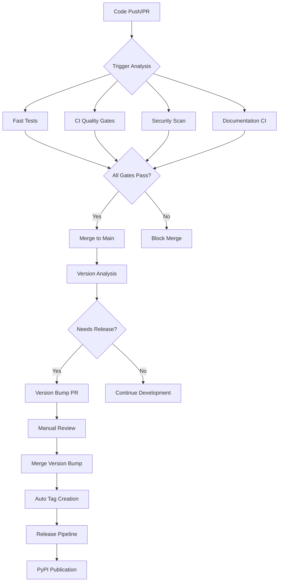
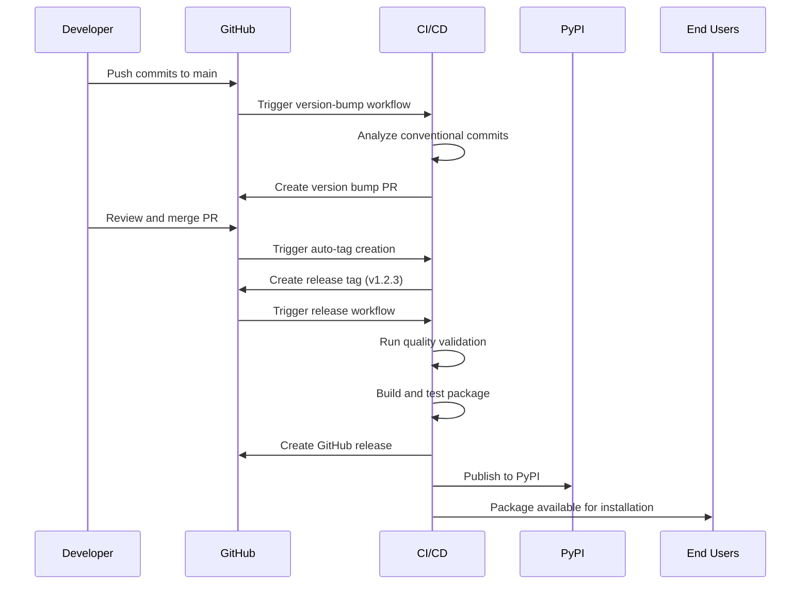
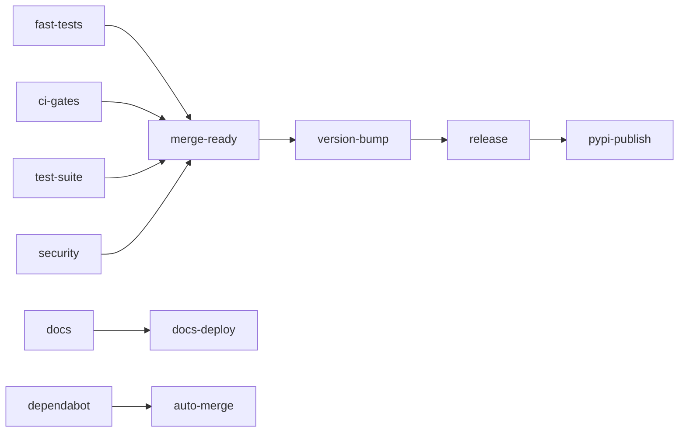

# CI/CD System Documentation

This document provides a comprehensive overview of the CI/CD system for the MarkItDown MCP project, including workflow diagrams, triggers, and dependencies.

## Related Documentation

- **[CI/CD Architecture Diagrams](ci-cd-architecture.md)** - Visual workflow diagrams and architecture
- **[CI/CD Quick Reference](ci-cd-quick-reference.md)** - Developer commands and troubleshooting
- **[Contributing Guide](CONTRIBUTING.md)** - Development workflow and contribution process
- **[Testing Strategy](TESTING_STRATEGY.md)** - Comprehensive testing approach

## Table of Contents

- [System Overview](#system-overview)
- [Workflow Architecture](#workflow-architecture)
- [Core Workflows](#core-workflows)
- [Quality Gates](#quality-gates)
- [Security & Dependencies](#security--dependencies)
- [Release Pipeline](#release-pipeline)
- [Documentation Workflows](#documentation-workflows)
- [Monitoring & Status](#monitoring--status)
- [Troubleshooting](#troubleshooting)

## System Overview

The CI/CD system is built on GitHub Actions and consists of 14 specialized workflows that handle different aspects of the development lifecycle:



## Workflow Architecture

### 1. **Development Phase Workflows**

These run on every PR and push to main:

#### **Fast Tests** (`fast-tests.yml`)
- **Purpose**: Quick validation for immediate feedback
- **Triggers**: PR (Python files), Push to main
- **Runtime**: ~2-3 minutes
- **Components**:
  - Unit tests with timeout protection (30s per test)
  - Integration smoke tests (60s timeout)
  - Flaky test detection
  - Quick security scan
  - Server startup validation

```yaml
Triggers:
  - pull_request: ['**.py', 'pyproject.toml', 'requirements*.txt']
  - push: [main]
  - workflow_dispatch

Jobs:
  ├── unit-tests-fast          # Fast unit tests (-m "not slow")
  ├── integration-smoke        # MCP protocol smoke tests
  ├── flaky-detection         # Detect unreliable tests
  ├── security-quick          # Bandit high-severity scan
  └── fast-tests-summary      # Results aggregation
```

#### **CI Quality Gates** (`ci-gates.yml`)
- **Purpose**: Comprehensive code quality enforcement
- **Triggers**: PR, Push to main/develop
- **Runtime**: ~3-5 minutes
- **Components**:
  - Code formatting (ruff format)
  - Linting (ruff check)
  - Type checking (mypy)
  - Unit test coverage (80% minimum)
  - MCP protocol contract validation
  - Dependency security audit

```yaml
Triggers:
  - pull_request
  - push: [main, develop]
  - workflow_dispatch

Jobs:
  ├── quality-checks           # Format, lint, type check
  ├── unit-tests-coverage     # Tests with 80% coverage requirement
  ├── mcp-contract-checks     # Protocol validation & schema checks
  ├── dependency-checks       # Security audit & consistency
  ├── pr-summary             # Generate PR status comment
  └── ci-gates-passed        # Final gate validation
```

#### **Test Suite** (`test.yml`)
- **Purpose**: Comprehensive testing across platforms
- **Triggers**: PR, Push, Manual dispatch
- **Runtime**: ~5-8 minutes
- **Components**:
  - Multi-platform testing (Ubuntu, macOS, Windows)
  - Python version matrix (3.10, 3.11, 3.12, 3.13)
  - Integration and compatibility tests
  - Documentation build validation
  - MCP protocol testing

```yaml
Matrix Testing:
  Python: [3.10, 3.11, 3.12, 3.13]
  OS: [ubuntu-latest, windows-latest, macos-latest]

Special Jobs:
  ├── Linting and Code Quality
  ├── Test Documentation Build
  ├── MCP Protocol Smoke Tests
  ├── Security Tests (conditional)
  ├── Performance Tests (conditional)
  └── Test Results Summary
```

### 2. **Quality Assurance Workflows**

#### **Security** (`security.yml`)
- **Purpose**: Comprehensive security scanning
- **Triggers**: PR, Push to main, Schedule (weekly)
- **Runtime**: ~2-4 minutes
- **Components**:
  - Static analysis (Bandit)
  - Dependency vulnerability scanning (Safety)
  - Secret detection (GitLeaks)
  - CodeQL analysis
  - Security advisory checks

#### **Documentation CI** (`docs.yml`)
- **Purpose**: Documentation quality and validation
- **Triggers**: Changes to docs, Python files, workflows
- **Runtime**: ~2-3 minutes
- **Components**:
  - Docstring style checking (PEP 257)
  - Coverage analysis (80% minimum)
  - Sphinx documentation build
  - Link validation and spell checking
  - MCP tool documentation validation

### 3. **Release Pipeline**

#### **Version Bump** (`version-bump.yml`)
- **Purpose**: Automated semantic versioning
- **Triggers**: Push to main, Schedule (weekly), Manual
- **Runtime**: ~1-2 minutes
- **Process**:
  1. Analyze commits since last release
  2. Determine version bump type (patch/minor/major)
  3. Generate changelog from conventional commits
  4. Create version bump PR with updated files
  5. Automated tag creation on merge

```yaml
Analysis Process:
  ├── Get latest tag
  ├── Analyze conventional commits
  ├── Determine bump type (scripts/analyze-version.py)
  ├── Generate changelog
  ├── Create PR with:
  │   ├── Updated pyproject.toml version
  │   ├── Updated CHANGELOG.md
  │   └── Conventional commit message
  └── Auto-tag on merge
```

#### **Release** (`release.yml`)
- **Purpose**: Automated release creation and publication
- **Triggers**: Tag creation (v*.*.*)
- **Runtime**: ~5-10 minutes
- **Process**:
  1. Quality validation
  2. Package building and testing
  3. GitHub release creation
  4. PyPI publication
  5. Post-release validation

#### **Pre-Release Testing** (`pre-release.yml`)
- **Purpose**: Release candidate validation
- **Triggers**: Pre-release tags, Manual dispatch
- **Runtime**: ~8-12 minutes
- **Components**:
  - Extended test matrix
  - Performance benchmarking
  - Integration testing
  - Test PyPI publication

### 4. **Support Workflows**

#### **Dependency Management**
- **Dependabot Auto** (`dependabot-auto.yml`): Auto-approve safe updates
- **Dependency Review** (`dependency-review.yml`): Review new dependencies

#### **Documentation Automation**
- **Auto-Generate Documentation** (`docs-autogen.yml`): API docs generation

#### **Project Management**
- **PR Summary & Status** (`pr-summary.yml`): Automated PR status reporting
- **Status Dashboard** (`status-dashboard.yml`): Project health monitoring

## Quality Gates

### Pre-Merge Requirements

All PRs must pass these gates before merging:

#### **Required Status Checks** (Enforced by Branch Protection)
1. **Fast Tests Summary** ✅
   - Unit tests pass
   - Integration smoke tests pass
   - No high-severity security issues

2. **All CI Gates Passed** ✅
   - Code formatting compliant
   - Linting passes
   - Type checking passes
   - 80%+ test coverage
   - MCP protocol validation

3. **Test Results Summary** ✅
   - Multi-platform compatibility
   - Python version compatibility
   - Documentation builds successfully

4. **Security** ✅
   - No critical vulnerabilities
   - No hardcoded secrets
   - Dependency audit clean

#### **Review Requirements** (Enforced by Branch Protection)
- **1 Approving Review Required** - All PRs must be reviewed by a maintainer
- **Stale Reviews Dismissed** - Reviews are dismissed when new commits are pushed
- **Code Owner Review** - Critical files require review from designated code owners
- **Admin Enforcement** - Rules apply to all users including repository administrators

### Coverage Requirements

- **Minimum**: 80% overall coverage
- **Enforcement**: CI Quality Gates workflow
- **Reporting**: Coverage reports in PR comments
- **Exclusions**: Test files, migration scripts

### Performance Benchmarks

- **Unit Tests**: < 30 seconds individual timeout
- **Integration Tests**: < 60 seconds timeout
- **Full Test Suite**: < 10 minutes total
- **Documentation Build**: < 2 minutes

## Release Pipeline Flow



### Version Management

- **Strategy**: Semantic Versioning (semver.org)
- **Automation**: Conventional Commits analysis
- **Triggers**:
  - `feat:` → Minor version bump
  - `fix:` → Patch version bump
  - `BREAKING CHANGE:` → Major version bump
  - Manual override available

### Release Types

1. **Patch Release** (1.0.x)
   - Bug fixes
   - Documentation updates
   - Non-breaking improvements

2. **Minor Release** (1.x.0)
   - New features
   - API additions
   - Performance improvements

3. **Major Release** (x.0.0)
   - Breaking changes
   - API modifications
   - Major architectural changes

## Security & Dependencies

### Security Scanning

- **Static Analysis**: Bandit (Python security linter)
- **Dependency Scanning**: Safety (vulnerability database)
- **Secret Detection**: GitLeaks (credential scanning)
- **Code Analysis**: GitHub CodeQL

### Dependency Management

- **Automated Updates**: Dependabot weekly scans
- **Security Monitoring**: GitHub Security Advisories
- **License Compliance**: Automated license checking
- **Version Pinning**: Minimum versions specified

### Security Policies

- **High-severity findings**: Block merge
- **Medium-severity**: Warning with review required
- **Dependency updates**: Auto-approve patch versions
- **Security patches**: Priority handling

## Monitoring & Status

### Health Metrics

- **Test Success Rate**: Target >95%
- **Build Time**: Target <10 minutes
- **Coverage**: Maintain >80%
- **Security Issues**: Zero high-severity

### Status Reporting

- **PR Comments**: Automated quality gate results
- **Status Dashboard**: Overall project health
- **Slack/Email**: Critical failure notifications
- **GitHub Checks**: Required status checks

### Troubleshooting Common Issues

#### Workflow Failures

1. **Test Timeouts**
   ```bash
   # Check for long-running tests
   pytest --durations=10
   ```

2. **Coverage Drops**
   ```bash
   # Generate detailed coverage report
   pytest --cov=markitdown_mcp --cov-report=html
   ```

3. **Security Findings**
   ```bash
   # Run security scan locally
   bandit -r markitdown_mcp/
   safety check
   ```

4. **MCP Protocol Issues**
   ```bash
   # Test MCP server locally
   python -m markitdown_mcp.server
   ```

#### Performance Issues

- **Slow Tests**: Use `pytest -m "not slow"` for fast feedback
- **Build Timeouts**: Check dependency cache hits
- **Matrix Builds**: Consider reducing matrix size for PRs

#### Release Issues

- **Version Conflicts**: Check conventional commit formatting
- **PyPI Upload**: Verify API tokens and package metadata
- **Tag Creation**: Ensure proper permissions and branch protection

## Configuration Files

### Core Configuration

- **pyproject.toml**: Project metadata, dependencies, tool configs
- **pytest.ini**: Test configuration and markers
- **.github/dependabot.yml**: Dependency update settings
- **scripts/analyze-version.py**: Version analysis logic

### Quality Tools

- **ruff**: Formatting and linting (configured in pyproject.toml)
- **mypy**: Type checking configuration
- **bandit**: Security analysis settings
- **coverage**: Coverage reporting and thresholds

## Best Practices

### For Developers

1. **Commit Messages**: Use conventional commits
2. **Testing**: Write tests for new features
3. **Documentation**: Update docs with changes
4. **Security**: Never commit secrets or credentials

### For Maintainers

1. **Release Planning**: Review changelog before releases
2. **Security**: Monitor vulnerability reports
3. **Performance**: Track build and test performance
4. **Dependencies**: Keep dependencies updated

### For CI/CD

1. **Fail Fast**: Quick feedback on common issues
2. **Comprehensive**: Full validation before release
3. **Secure**: Validate all inputs and outputs
4. **Monitored**: Track metrics and failures

## Workflow Dependencies



This CI/CD system ensures high-quality, secure, and reliable releases while maintaining developer productivity and code quality standards.