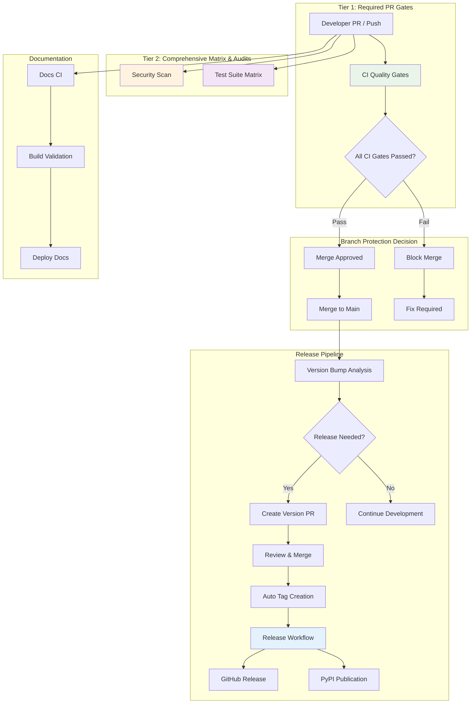
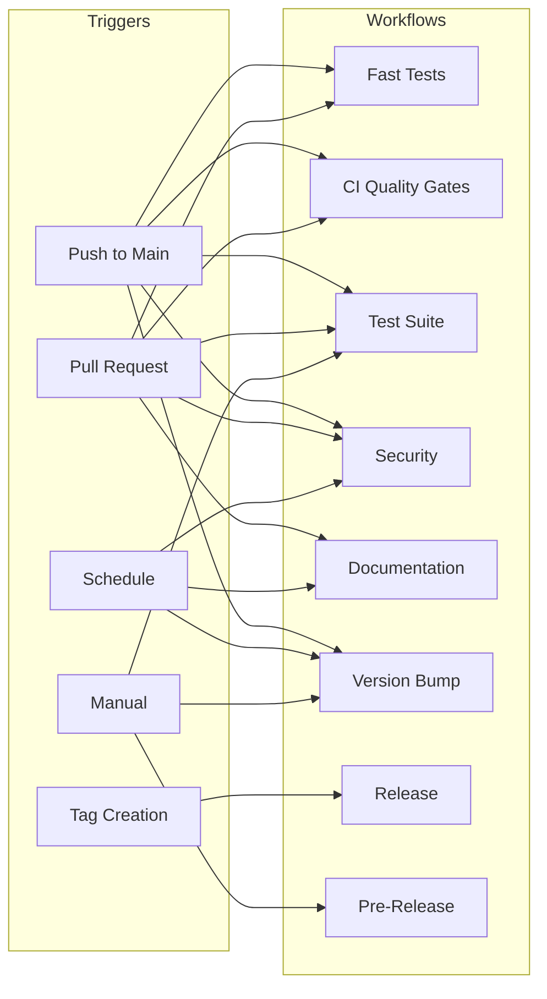
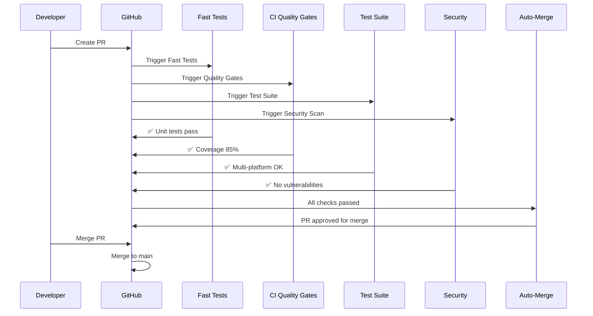
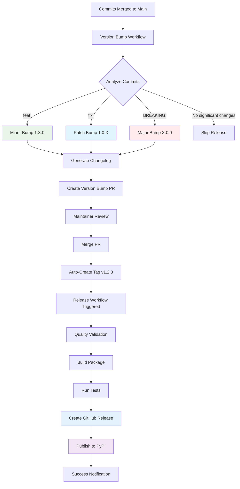
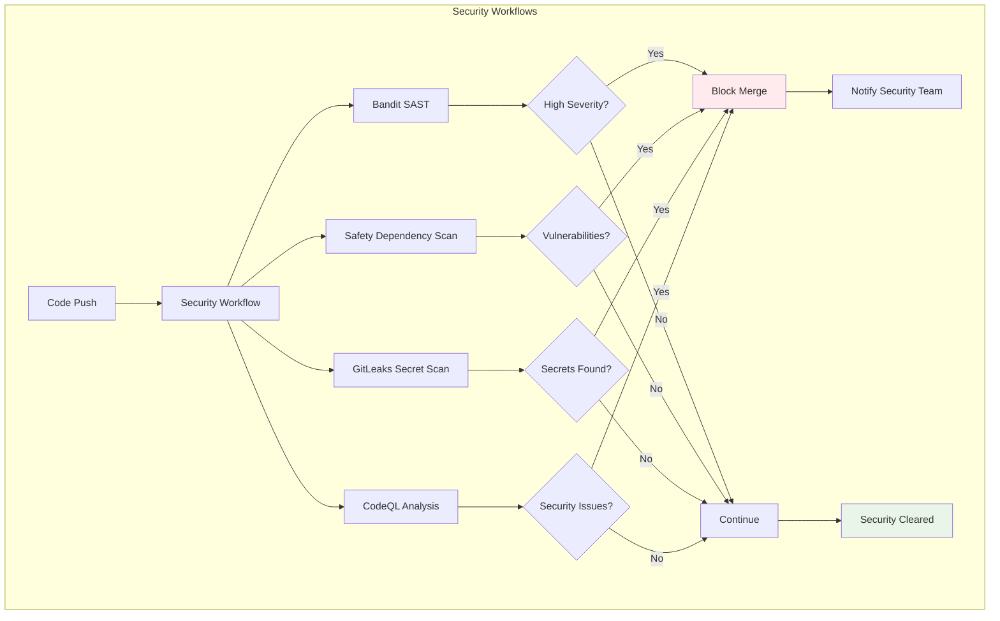
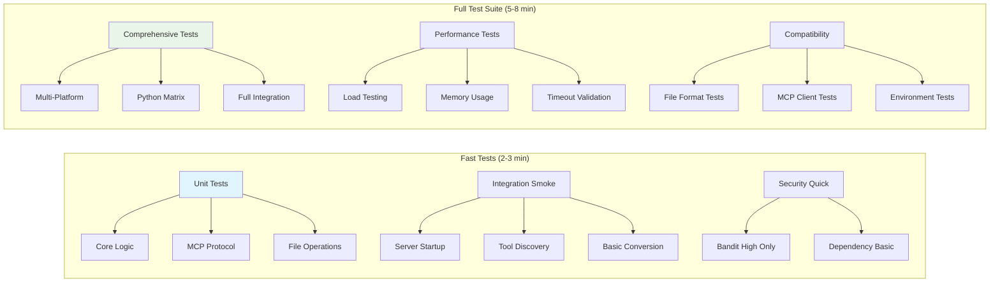
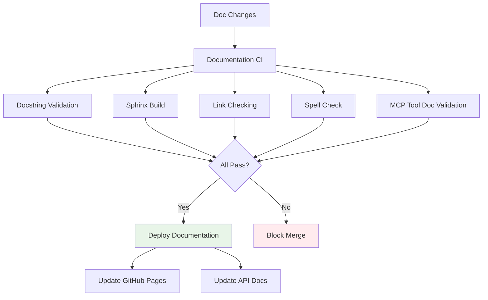
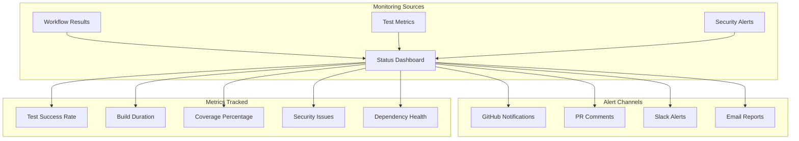
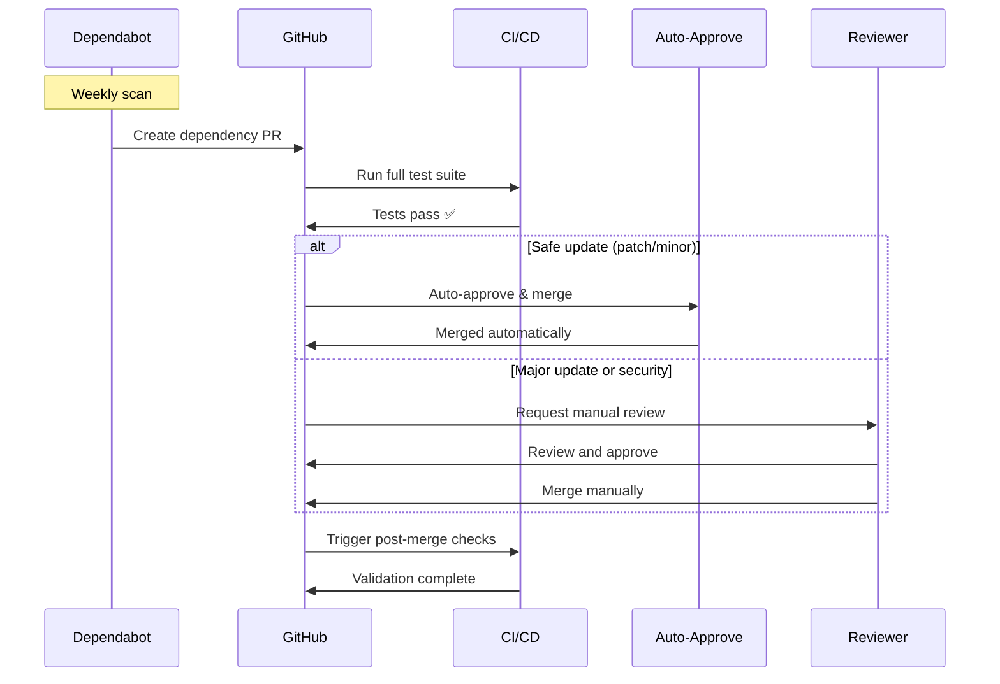

# CI/CD Architecture Diagrams

This document contains visual representations of the CI/CD system architecture and workflow flows.

## Overall Tiered System Architecture

## Workflow Trigger Matrix

## Quality Gates Flow

## Release Pipeline Flow

## Security Scanning Pipeline

## Test Strategy Architecture

## Documentation Workflow

## Monitoring and Alerting

## Dependency Management Flow

This architecture ensures:

- **Fast Feedback**: Quick validation for common issues
- **Comprehensive Coverage**: Full validation before release
- **Security First**: Multiple security layers
- **Quality Gates**: Enforced standards at every step
- **Automated Releases**: Minimal manual intervention
- **Monitoring**: Full visibility into system health